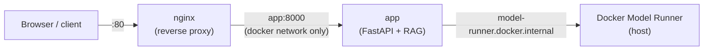

# OralLink RAG Tester

A mock retrieval-augmented generation (RAG) app for testing [Docker Model Runner](https://docs.docker.com/ai/model-runner/) models. A FastAPI backend (`backend/`) retrieves relevant passages from a local knowledge base (`backend/data/sample/`) and asks the model to answer using only that context. A simple web UI (`backend/static/index.html`) shows the answer alongside the retrieved sources.

Defaults to **Ministral 3 8B**, a small, fast local model good for quick interactive testing. **Qwen SEA-LION v4 32B** (tuned for Southeast Asian languages — Malay, Tamil, Chinese, Indonesian, etc. — a better fit for OralLink's Singapore audience) and **GPT-OSS-20B** are also supported; GPT-OSS-20B is what the [production EC2 deployment guide](#production-deployment-aws-ec2-gpu) below was actually validated against on real GPU hardware. GPT-OSS and SEA-LION are reasoning models (they stream a `reasoning_content` chain-of-thought before the final answer) — the app handles this generically, and it's just as happy with a non-reasoning model like Ministral, which simply never emits `reasoning_content`. Swapping between any of these — or any other Docker Model Runner model — is just a `DMR_MODEL` config change, no code changes needed.

Retrieval is a small pure-Python TF-IDF / cosine-similarity index (`backend/rag.py`) — no vector DB or embedding model required. It's a mockup meant to demonstrate the RAG pattern end-to-end, not a production-grade retriever.

## Contents

- [Prerequisites](#prerequisites)
- [Project layout](#project-layout)
- [Project setup](#project-setup)
- [Configuration](#configuration)
- [Running the app](#running-the-app)
- [Running with Docker (local development)](#running-with-docker-local-development)
  - [Docker prerequisites](#docker-prerequisites)
  - [Build and start](#build-and-start)
  - [Everyday commands](#everyday-commands)
  - [Why nginx, and why SSE still works through it](#why-nginx-and-why-sse-still-works-through-it)
  - [How configuration works in Docker](#how-configuration-works-in-docker)
  - [Why the base URL differs in Docker](#why-the-base-url-differs-in-docker)
- [Production deployment (AWS EC2 GPU)](#production-deployment-aws-ec2-gpu)
  - [1. Launch the EC2 instance](#1-launch-the-ec2-instance)
  - [2. Install Docker Engine](#2-install-docker-engine)
  - [3. GPU driver and NVIDIA Container Toolkit](#3-gpu-driver-and-nvidia-container-toolkit)
  - [4. Install the Docker Model Runner plugin](#4-install-the-docker-model-runner-plugin)
  - [5. Pull gpt-oss:latest and verify GPU is used](#5-pull-gpt-osslatest-and-verify-gpu-is-used)
  - [6. Build and export the application image](#6-build-and-export-the-application-image)
  - [7. Transfer the image and compose files to the instance](#7-transfer-the-image-and-compose-files-to-the-instance)
  - [8. docker-compose.prod.yml](#8-docker-composeprodyml)
  - [9. Load and run on the EC2 instance](#9-load-and-run-on-the-ec2-instance)
  - [10. Verify the full stack end-to-end](#10-verify-the-full-stack-end-to-end)
  - [11. Redeploying updates](#11-redeploying-updates)
  - [What's still not covered](#whats-still-not-covered)
- [Notes](#notes)

## Prerequisites

- Python 3.10+
- Docker Desktop with [Docker Model Runner](https://docs.docker.com/ai/model-runner/) enabled and at least one model pulled:

  ```powershell
  docker model pull ai/ministral3:8B-Q4_K_M
  # or, for the SEA-LION / gpt-oss alternatives described below:
  docker model pull huggingface.co/mradermacher/qwen-sea-lion-v4-32b-it-gguf:Q4_K_M
  docker model pull ai/gpt-oss
  ```

  Model Runner listens on `http://localhost:12434` by default. Confirm the exact tag you have with `docker model list` — it must match `DMR_MODEL` below (see [Configuration](#configuration)). Note: Ministral 3 8B (~4.8GB) is comfortably fast on CPU-only Docker Desktop; SEA-LION is a ~32B-parameter model (~18.4GB) — noticeably slower than gpt-oss-20b or Ministral on CPU-only Docker Desktop; it's much more usable with GPU acceleration (see [Production deployment](#production-deployment-aws-ec2-gpu)).

## Project layout

```
backend/
  app.py              FastAPI app: RAG endpoint + Docker Model Runner proxy
  rag.py              TF-IDF retrieval over the knowledge base
  static/index.html   Web UI
  data/sample/         Knowledge base documents (OralLink dental content)
  requirements.txt
  .env.example         Copy to .env to configure locally
nginx/
  default.conf         Reverse proxy config (public port 80 -> app:8000)
Dockerfile
docker-compose.yml       Local development: builds app from source, live-mounts data/static
docker-compose.prod.yml  Production (EC2): runs a pre-built image loaded via `docker load`
```

## Project setup

1. Create and activate a virtual environment inside `backend/`:

   ```powershell
   cd backend
   python -m venv .venv
   .venv\Scripts\activate
   ```

2. Install dependencies:

   ```powershell
   pip install -r requirements.txt
   ```

3. Copy the example env file and adjust if needed:

   ```powershell
   copy .env.example .env
   ```

## Configuration

Configuration lives in `backend/.env` (loaded automatically via `python-dotenv`):

| Variable | Default | Purpose |
|---|---|---|
| `DMR_BASE_URL` | `http://localhost:12434/engines/v1` | Docker Model Runner's OpenAI-compatible endpoint |
| `DMR_MODEL` | `docker.io/ai/ministral3:8B-Q4_K_M` | Startup default model — must match a model already pulled (`docker model list`). Alternative tested values: `ai/gpt-oss:latest`, `huggingface.co/mradermacher/qwen-sea-lion-v4-32b-it-gguf:Q4_K_M`. Can be switched at runtime without restarting via the web UI's model dropdown, or `POST /api/model` — see [Running the app](#running-the-app) |
| `RAG_TOP_K` | `4` | Number of knowledge-base chunks to retrieve per question |
| `DATA_DIR` | `data/sample` | Folder of documents to index, relative to `backend/` (or absolute) |
| `RAG_MAX_TOKENS` | `800` | Max tokens the model may generate per answer. Reasoning models (gpt-oss, SEA-LION) spend part of this on their own chain-of-thought before the final answer — see [Notes](#notes). Ministral isn't a reasoning model, so its full budget goes to the answer |
| `REASONING_EFFORT` | `low` | Reasoning depth: `low`/`medium`/`high` — lower is faster. Confirmed accepted (no error) by gpt-oss, SEA-LION, and Ministral, though only gpt-oss was confirmed to actually shorten its reasoning in response to it; Ministral isn't a reasoning model and simply ignores it |

This file is only read when running the backend directly with `uvicorn` on your host — see the note in [Running with Docker](#running-with-docker-local-development) for how configuration works inside the container instead.

## Running the app

From `backend/`, start the FastAPI server with uvicorn:

```powershell
uvicorn app:app --reload
```

Then open [http://localhost:8000](http://localhost:8000) to ask questions against the knowledge base. Endpoints:

- `GET /api/config` — current model, endpoint, data dir, and chunk count
- `GET /api/sources` — indexed source files and chunk counts
- `POST /api/ask` — `{"question": "...", "top_k": 4}` → retrieves context, asks the model, returns the answer plus the sources used
- `POST /api/ask/stream` — same request shape, but returns a `text/event-stream` (SSE) response with `sources`, `reasoning`, `token`, and `done` events as the model generates. This is what the web UI uses.
- `POST /api/reload` — re-index `DATA_DIR` after editing the knowledge base, without restarting the server
- `GET /api/models` — passthrough to Docker Model Runner's model list (useful for confirming the exact tag to put in `DMR_MODEL`, and what the web UI's model dropdown is populated from)
- `POST /api/model` — `{"model": "<tag>"}` → switches which model `/api/ask` and `/api/ask/stream` use, without restarting the server. Only accepts a tag already present in `GET /api/models` (i.e. already pulled into Docker Model Runner) — this app never triggers a pull itself; run `docker model pull <tag>` first for anything new.

## Running with Docker (local development)

The stack is two containers behind Docker Compose: `nginx` (public entrypoint, port 80) reverse-proxying to `app` (the FastAPI backend, not published to the host directly). Everything below is run from the repo root, where `Dockerfile`, `docker-compose.yml`, and `nginx/` live.



### Docker prerequisites

- Docker Desktop installed and running, with Model Runner enabled and a model pulled (see [Prerequisites](#prerequisites) above).

### Build and start

```powershell
docker compose up --build -d
```

- `--build` rebuilds the `app` image first — required whenever `backend/app.py`, `backend/rag.py`, or `backend/requirements.txt` change. `nginx` uses the stock `nginx:alpine` image, so it never needs rebuilding — only a restart if `nginx/default.conf` changes.
- `-d` runs both containers in the background ("detached"). Drop it to stream logs in the foreground instead (`Ctrl+C` stops them).

Compose names containers `<project-folder-name>-<service>-1` — in this repo, `testdockermodelrunner-app-1` and `testdockermodelrunner-nginx-1`.

Once it's up, open **[http://localhost](http://localhost)** (port 80, via nginx) in a browser — not `:8000`; the `app` container no longer publishes a host port, so it's only reachable from `nginx` over the internal Docker network.

### Everyday commands

| Task | Command |
|---|---|
| Start (no rebuild) | `docker compose up -d` |
| Rebuild `app` + start after code changes | `docker compose up --build -d` |
| Restart nginx after editing `nginx/default.conf` | `docker compose restart nginx` |
| View logs | `docker compose logs -f app nginx` |
| Check status | `docker compose ps` |
| Shell into a container | `docker compose exec app bash` / `docker compose exec nginx sh` |
| Stop and remove | `docker compose down` |

`docker-compose.yml` also mounts `backend/data/sample` and `backend/static` into the `app` container read-only, so editing the knowledge base or the UI **doesn't** require a rebuild — for data changes, call `POST /api/reload` afterwards; for UI changes, just refresh the browser. Only edits to `backend/app.py`, `backend/rag.py`, or `backend/requirements.txt` need `--build`.

### Why nginx, and why SSE still works through it

`nginx/default.conf` proxies all traffic on port 80 to `app:8000` and sets `proxy_buffering off` — without that, nginx would wait for the full response before forwarding anything, which would silently break the SSE streaming behavior of `POST /api/ask/stream` (you'd get one long pause instead of live tokens). It also raises `proxy_read_timeout`/`proxy_send_timeout` to ~15 minutes to match the backend's own generous timeout for slow first-load model calls.

If you need direct access to the `app` container for debugging (bypassing nginx), temporarily add back a `ports: ["8000:8000"]` entry under `app` in `docker-compose.yml`, or use `docker compose exec app curl http://localhost:8000/api/config`.

### How configuration works in Docker

`docker-compose.yml` sets `DMR_BASE_URL`, `DMR_MODEL`, `RAG_TOP_K`, `RAG_MAX_TOKENS`, and `REASONING_EFFORT` directly in the `app` service's `environment:` block — edit them there for the containerized app. `backend/.env` **is** copied into the `app` image (via the Dockerfile), but it has no effect when running through `docker-compose.yml`: those environment variables are already set by Docker before the process starts, and `python-dotenv`'s `load_dotenv()` never overrides a variable that's already set. `.env` only actually takes effect when running the backend directly with `uvicorn` on your host, or with plain `docker run` and no `-e` flags overriding the same names.

### Why the base URL differs in Docker

From the host machine, Model Runner is reachable at `http://localhost:12434/engines/v1`. From inside a container, `localhost` refers to the container itself, not the host — so `docker-compose.yml` instead points `DMR_BASE_URL` at Docker Desktop's special internal DNS name:

```
http://model-runner.docker.internal/engines/v1
```

If you're running just the `app` container with plain `docker run` instead of Compose, you bypass nginx entirely (there's no proxy in front unless you also run the nginx image and network it yourself) — pass the same variables explicitly and publish the port directly:

```powershell
docker build -t orallink-rag .
docker run --rm -p 8000:8000 ^
  -e DMR_BASE_URL=http://model-runner.docker.internal/engines/v1 ^
  -e DMR_MODEL=docker.io/ai/ministral3:8B-Q4_K_M ^
  -e RAG_MAX_TOKENS=800 ^
  -e REASONING_EFFORT=low ^
  orallink-rag
```

## Production deployment (AWS EC2 GPU)

Steps for getting Docker Model Runner running with GPU acceleration on an AWS EC2 GPU instance, then deploying this repo's `app` + `nginx` stack on top of it. The deployment approach mirrors how the OralLink production project itself ships: build and tag the image locally, export it with `docker save`, transfer the `.tar` to the instance, and `docker load` it there — the instance never needs the source code, a Python toolchain, or a Docker build.

A few things worth flagging up front, since they differ from generic guidance you might find elsewhere:

- **Endpoint path**: this project's `DMR_BASE_URL` default, and every test run against it, uses `http://localhost:12434/engines/v1/...` (no `llama.cpp` segment). Some Docker Model Runner guidance elsewhere uses `.../engines/llama.cpp/v1/...` — re-confirm the actual path on your instance rather than assuming either is correct.
- **`model-runner.docker.internal` does not resolve on EC2/Linux** — confirmed on a real `g6.xlarge` Ubuntu instance (`Name or service not known`). That hostname only works on Docker Desktop. `docker-compose.prod.yml` (step 8) already uses the working alternative: `host.docker.internal` + `extra_hosts: ["host.docker.internal:host-gateway"]`.
- **Disk size**: rarely mentioned in guides, but the gpt-oss-20b Q4 quant weighs in at ~11GB by itself — Ubuntu's default 8GB root volume isn't enough.

### 1. Launch the EC2 instance

- **Type**: `g6.xlarge` (1× NVIDIA L4, 24GB VRAM, 4 vCPU, 16GB RAM) — the newer Ada Lovelace generation, generally cheaper to run than `g5.xlarge`'s A10G for similar VRAM. Sized around gpt-oss-20b, whose Q4_K_M weights are ~11GB, leaving comfortable headroom for KV cache/context on a 24GB card — this is the model steps 1–5 below actually validate on real GPU hardware. If you plan to run **Qwen SEA-LION v4 32B** instead (a supported alternative — see [Configuration](#configuration)), note its weights are ~18.4GB, leaving much less headroom on the same 24GB card; this combination hasn't been GPU-tested, only confirmed working (very slowly) on CPU-only Docker Desktop — verify it actually fits before relying on it, and consider a larger GPU instance if context runs out of memory.
- **AMI**: Ubuntu 22.04 or 24.04 LTS.
- **Storage**: at least **100GB gp3** root volume — more if you want both models pulled side by side (gpt-oss ~11GB + SEA-LION ~18.4GB). `g6.xlarge` also ships with an ephemeral NVMe instance store, but that doesn't survive a stop/start — don't rely on it for anything persistent.
- **Security group**:
  - `22` (SSH) restricted to your IP, not `0.0.0.0/0`
  - `80` (and `443` later, if TLS is added) open to whoever needs to reach the app
  - **Do not** open `12434` (Docker Model Runner) or `8000` (the `app` container) to the internet — both must stay internal-only, matching how the local Compose stack keeps `app` off the host's public interface.

### 2. Install Docker Engine

```bash
sudo apt update
sudo apt install -y ca-certificates curl gnupg
sudo install -m 0755 -d /etc/apt/keyrings
curl -fsSL https://download.docker.com/linux/ubuntu/gpg | sudo gpg --dearmor -o /etc/apt/keyrings/docker.gpg
sudo chmod a+r /etc/apt/keyrings/docker.gpg

echo \
  "deb [arch=$(dpkg --print-architecture) signed-by=/etc/apt/keyrings/docker.gpg] https://download.docker.com/linux/ubuntu \
  $(. /etc/os-release && echo "$VERSION_CODENAME") stable" | \
  sudo tee /etc/apt/sources.list.d/docker.list > /dev/null

sudo apt update
sudo apt install -y docker-ce docker-ce-cli containerd.io docker-buildx-plugin docker-compose-plugin
sudo usermod -aG docker $USER
newgrp docker
```

### 3. GPU driver and NVIDIA Container Toolkit

```bash
sudo apt install -y ubuntu-drivers-common
sudo ubuntu-drivers autoinstall
sudo reboot
```

After reboot:

```bash
curl -fsSL https://nvidia.github.io/libnvidia-container/gpgkey | sudo gpg --dearmor -o /usr/share/keyrings/nvidia-container-toolkit-keyring.gpg
curl -s -L https://nvidia.github.io/libnvidia-container/stable/deb/nvidia-container-toolkit.list | \
  sed 's#deb https://#deb [signed-by=/usr/share/keyrings/nvidia-container-toolkit-keyring.gpg] https://#g' | \
  sudo tee /etc/apt/sources.list.d/nvidia-container-toolkit.list

sudo apt update
sudo apt install -y nvidia-container-toolkit
sudo nvidia-ctk runtime configure --runtime=docker
sudo systemctl restart docker

nvidia-smi   # must show the L4 before continuing
```

### 4. Install the Docker Model Runner plugin

```bash
sudo apt install -y docker-model-plugin
docker model version
```

This package name isn't verified against a live Linux box in this project — Docker Model Runner was only tested against Docker Desktop on Windows here. Check `apt list -a docker-model-plugin` and cross-reference [Docker's Model Runner docs](https://docs.docker.com/ai/model-runner/) for the current Linux install method before relying on this; it has moved around across Docker releases.

### 5. Pull gpt-oss:latest and verify GPU is used

```bash
docker model pull ai/gpt-oss
docker model list
```

Get the **exact tag** from `docker model list` — don't assume `ai/gpt-oss:20b`. This project hit that exact trap: the assumed tag didn't exist, and the real pulled tag turned out to be `ai/gpt-oss:latest`. Whatever tag comes back here is what belongs in `DMR_MODEL` in `docker-compose.yml`.

Then confirm the endpoint and that it's actually hitting the GPU, not silently falling back to CPU:

```bash
# in one terminal, watch GPU usage
watch -n1 nvidia-smi

# in another, send a request against the path this app actually uses
curl -s http://localhost:12434/engines/v1/chat/completions \
  -H "Content-Type: application/json" \
  -d '{"model":"ai/gpt-oss:latest","messages":[{"role":"user","content":"Say hello in 3 words."}],"max_tokens":50}'
```

`nvidia-smi` should show GPU utilization while that request runs — if it stays flat, Model Runner isn't using the GPU and the driver/toolkit/runtime configuration needs revisiting before deploying the app on top.

**If deploying Qwen SEA-LION v4 32B instead** (a supported alternative — see [Configuration](#configuration)), repeat this step's pull-and-verify with its tag before trusting it in production:

```bash
docker model pull huggingface.co/mradermacher/qwen-sea-lion-v4-32b-it-gguf:Q4_K_M
curl -s http://localhost:12434/engines/v1/chat/completions \
  -H "Content-Type: application/json" \
  -d '{"model":"huggingface.co/mradermacher/qwen-sea-lion-v4-32b-it-gguf:Q4_K_M","messages":[{"role":"user","content":"Say hello in 3 words."}],"max_tokens":50}'
```

This combination is untested on GPU — on CPU-only Docker Desktop it worked correctly (confirming the config wiring is sound) but ran at roughly **0.34 tokens/sec**, meaning `RAG_MAX_TOKENS=800` could take ~40 minutes to complete. It should be dramatically faster with real GPU acceleration, but that needs confirming here, the same way `nvidia-smi` confirmed it for gpt-oss above, before assuming it's usable interactively.

### 6. Build and export the application image

Run this on your development machine (or CI), not on the EC2 instance — the instance never needs the source code or a Docker build toolchain, only the finished image.

```powershell
cd C:\MyWork\_NYP_Project\Orallink\TestDockerModelRunner
docker build -t orallink-rag:latest .
docker save -o orallink-rag.tar orallink-rag:latest
```

For traceability across deploys, tag with a version instead of (or as well as) `:latest` — e.g. `docker build -t orallink-rag:2026-08-03 .` — and use that same tag consistently through the steps below.

### 7. Transfer the image and compose files to the instance

Only three things need to reach the instance — not the full repo:

```
orallink-rag.tar          # from step 6
docker-compose.prod.yml   # from step 8, already in this repo
nginx/default.conf        # already in this repo, unchanged
```

```bash
ssh -i your-key.pem ubuntu@<EC2_PUBLIC_IP> "mkdir -p ~/orallink/nginx"
scp -i your-key.pem orallink-rag.tar docker-compose.prod.yml ubuntu@<EC2_PUBLIC_IP>:~/orallink/
scp -i your-key.pem nginx/default.conf ubuntu@<EC2_PUBLIC_IP>:~/orallink/nginx/
```

### 8. docker-compose.prod.yml

This lives in the repo alongside the local-development `docker-compose.yml` (it's what gets transferred in step 7). The key differences from the dev version: `image:` instead of `build:` (no source on the box to build from), no live-editing volume mounts for `data/sample`/`static` (those are already baked into the image — see [How configuration works in Docker](#how-configuration-works-in-docker) for the same `.env`-baking reasoning applied here), and `restart: unless-stopped` on both services so the stack survives a reboot or crash.

`DMR_BASE_URL` uses `host.docker.internal` + `extra_hosts: host-gateway`, **not** `model-runner.docker.internal`. This was tested on a real `g6.xlarge`/Ubuntu instance: `model-runner.docker.internal` failed with `Name or service not known` (that hostname is Docker Desktop–specific), while `host.docker.internal` + `host-gateway` worked immediately. Model Runner on Linux/Engine also runs as its own container (`docker/model-runner:latest-cuda`, visible in `docker images`), unlike Desktop where it's built into the Desktop VM — but it still listens on the host's `12434`, which `host.docker.internal` reaches correctly.

```yaml
services:
  app:
    image: orallink-rag:latest
    restart: unless-stopped
    expose:
      - "8000"
    environment:
      # model-runner.docker.internal only resolves on Docker Desktop.
      # Confirmed on a real g6.xlarge/Ubuntu EC2 instance that it does NOT
      # resolve there — use host.docker.internal + extra_hosts instead.
      - DMR_BASE_URL=http://host.docker.internal:12434/engines/v1
      - DMR_MODEL=ai/gpt-oss:latest
      - RAG_TOP_K=4
      - RAG_MAX_TOKENS=800
      - REASONING_EFFORT=low
    extra_hosts:
      - "host.docker.internal:host-gateway"

  nginx:
    image: nginx:alpine
    restart: unless-stopped
    ports:
      - "80:80"
    volumes:
      - ./nginx/default.conf:/etc/nginx/conf.d/default.conf:ro
    depends_on:
      - app
```

This exact file was tested end-to-end twice: locally (built and tagged the image, `docker save`'d it, deleted the local image to simulate a clean machine, `docker load`'d it back, brought the stack up purely from the loaded image) and on a real `g6.xlarge` EC2 instance, where it confirmed the `host.docker.internal` fix above. Both times, static UI, `/api/config`, and a full `/api/ask` round-trip worked correctly.

### 9. Load and run on the EC2 instance

```bash
ssh -i your-key.pem ubuntu@<EC2_PUBLIC_IP>
cd ~/orallink

docker load -i orallink-rag.tar
docker images   # confirm orallink-rag:latest is present

docker compose -f docker-compose.prod.yml up -d
```

To stop the stack later:

```bash
docker compose -f docker-compose.prod.yml stop      # stop containers, keep them (and volumes/network) for a quick restart
docker compose -f docker-compose.prod.yml start     # ...and bring them back up again

docker compose -f docker-compose.prod.yml down      # or: stop AND remove containers + network
```

If you're on a different Model Runner setup and want to double-check connectivity before starting the stack, run this first — it exercises the exact route the `app` container uses:

```bash
docker run --rm --add-host=host.docker.internal:host-gateway \
  --entrypoint python orallink-rag:latest -c "
import urllib.request
try:
    urllib.request.urlopen('http://host.docker.internal:12434/engines/v1/models', timeout=5)
    print('OK')
except Exception as e:
    print('FAILED', e)
"
```

### 10. Verify the full stack end-to-end

```bash
curl -s http://localhost/api/config
curl -s -X POST http://localhost/api/ask \
  -H "Content-Type: application/json" \
  -d '{"question":"How does Oral Link screening work?"}'
```

Then from outside the instance, confirm the security group actually allows it: open `http://<EC2_PUBLIC_IP>` in a browser and ask a question through the UI. The answer streams back the same way it did in local development — now generated on the instance's own GPU instead of your workstation's.

### 11. Redeploying updates

There's no `git pull` on the instance — a new version means repeating steps 6–9: rebuild and retag the image, re-save, re-transfer, `docker load` again, then recreate just the `app` container to pick up the new image:

```bash
docker compose -f docker-compose.prod.yml up -d --force-recreate app
```

`nginx` only needs `docker compose -f docker-compose.prod.yml restart nginx` if `nginx/default.conf` itself changed.

### What's still not covered

- **TLS/HTTPS** — the stack is still plain HTTP on port 80, same as local development. For real public exposure, add either a Let's Encrypt/certbot setup in front of nginx, or terminate TLS at an ALB/CloudFront in front of the instance with an ACM certificate.
- **Domain name / Elastic IP** — attach an Elastic IP (so the address survives a stop/start) and point DNS at it if this needs a stable public hostname.
- **Log persistence & monitoring** — `docker compose logs` is ephemeral by default; consider the CloudWatch agent or a log-shipping sidecar if you need history beyond what's in the containers.

## Notes

- Large models can take several minutes to load into memory on first use; `/api/ask` uses a generous read timeout (15 minutes) to accommodate this.
- The knowledge base under `backend/data/sample/` covers OralLink's AI dental screening service, general oral hygiene education, cost/subsidy info, and Singapore dental providers — swap in your own `.txt` files (chunked with `--- CHUNK ---` blocks or `SECTION N:` headers, or plain prose) to test RAG over different content.
- gpt-oss and Qwen SEA-LION v4 are **reasoning models** — before producing a final answer they stream a `reasoning_content` chain-of-thought (visible live in the UI's collapsible "Reasoning" block), which eats into `RAG_MAX_TOKENS` before any answer text appears. On a short token budget you can get an empty `answer` because the whole budget was spent reasoning — this is expected, not a bug; raise `RAG_MAX_TOKENS` or lower `REASONING_EFFORT` if it happens consistently. Ministral 3 8B (the current default) is not a reasoning model — it never emits `reasoning_content`, so its whole `RAG_MAX_TOKENS` budget goes straight to the answer.
- gpt-oss and SEA-LION respond fluently in Malay, Tamil, and Chinese when asked directly (tested against the raw Docker Model Runner endpoint) — but retrieval in `backend/rag.py` only tokenizes Latin-script words, and the knowledge base itself is English-only. A question asked entirely in Chinese or Tamil will likely retrieve no relevant chunks even though the model could otherwise answer in that language — genuine multilingual RAG would need a Unicode-aware tokenizer and/or a translated knowledge base, neither of which is implemented here. Ministral's multilingual fluency hasn't been separately verified here.
- A standalone script, [query_model.py](query_model.py), talks directly to Docker Model Runner's OpenAI-compatible API (stdlib only, no app/venv needed) — useful for a quick console sanity check of a model independent of this app: `python query_model.py "your question"`.
