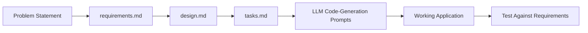

# Practical Exercise: Web Translator using Spec-Driven Development (SDD) + LLM Code Generation

**ITI226 AI Inovation and Deep Learning Project**

---

## Objective

Learners will practice **Spec-Driven Development (SDD)** — Requirements → Design → Tasks → Implementation — while using an LLM to generate the code for a web-based translator application. Instead of jumping straight to prompting an LLM for code, learners will first specify *what* they are building and *how* it should work, then use those specs to drive precise, high-quality code-generation prompts.

By the end of this exercise, learners will be able to:
1. Translate a problem statement into EARS-format requirements.
2. Translate requirements into a technical design (architecture, data models, API contract).
3. Break a design into a sequenced, traceable implementation task list.
4. Use their own spec documents — not vague instructions — as the source material for LLM code-generation prompts.
5. Reflect on how specification quality affects code-generation quality.

---

## Why Spec-Driven Development?

When learners prompt an LLM directly with "build me a translator app," the LLM has to *guess* at scope, error handling, and interface contracts — and so do the learners when reviewing the output. SDD removes the guessing:



Each artifact becomes the *input* to the next stage — including the code-generation prompts, which should be written by pulling directly from `design.md` (API contracts, data models) and `tasks.md` (scope, acceptance criteria) rather than being freehand.

---

## The Problem Statement (given to learners)

> Build a web-based translator application with a frontend and backend. A user enters text in the frontend and selects a target language. The backend receives the text and target language, detects the source language, translates the text, and returns the source text, detected source language, and translated text. The frontend displays the source and translated text, and optionally allows the user to hear the translated text read aloud.

This is deliberately the same problem the original practical solved directly with code-gen prompts — the difference now is that learners must specify it before building it.

---

## Phase 1: Requirements

**Template to use:** `requirements-template.md`
**Input:** The problem statement above
**Output:** `requirements.md`

### Instructions
1. Fill in **Document Information** (feature name: e.g. "Web Translator App", version, date, your name).
2. Write the **Introduction** (problem, business value, scope) in your own words — 2–3 paragraphs max.
3. Write **at least 3 requirements** in EARS format, each with a user story and acceptance criteria. Suggested breakdown (you may organize differently):
   - Requirement 1: Text input and language selection (frontend)
   - Requirement 2: Translation and language detection (backend)
   - Requirement 3: Displaying results and read-aloud (frontend)
4. Complete **Non-Functional Requirements** — think about response time, what happens if the backend is unreachable, and accessibility of the read-aloud feature.
5. Complete **Constraints and Assumptions** — note the `googletrans==4.0.0-rc1` version constraint mentioned in the practical brief; this belongs here, not in your requirements text.
6. Complete the **Glossary** — define terms like "source language," "target language," "detected language."
7. Run through the **Requirements Review Checklist** in the template before moving on.

### Worked example (Requirement 1 only — write the rest yourself)

> **Requirement 1: Text Input and Language Selection**
>
> **User Story:** As a user, I want to enter text and select a target language, so that I can request a translation into the language I need.
>
> **Acceptance Criteria:**
> 1. WHEN the user types text into the input box THEN the Frontend SHALL enable the translate button only if the input is non-empty.
> 2. WHEN the user opens the language dropdown THEN the Frontend SHALL display a list of supported target languages.
> 3. IF the user clicks translate without selecting a target language THEN the Frontend SHALL display a validation message and SHALL NOT send a request.
> 4. WHILE a translation request is in progress THEN the Frontend SHALL disable the translate button and show a loading indicator.
>
> **Additional Details**
> - Priority: High
> - Complexity: Low
> - Dependencies: None
> - Assumptions: Supported languages are a fixed list configured in the frontend.

Notice this single requirement already surfaces details the original practical's code-gen prompt never mentioned (empty-input handling, loading state, missing-language validation). That's the point of doing this before generating code.

---

## Phase 2: Design

**Template to use:** `design-template.md`
**Input:** Your completed `requirements.md`
**Output:** `design.md`

### Instructions
1. **Overview & Design Goals** — summarize the approach (e.g., stateless REST call from a static frontend to a Flask backend).
2. **Architecture diagrams** — adapt the template's Mermaid diagrams to show: Frontend (HTML/JS) → Backend (Flask) → googletrans library. Keep it to two components; don't over-engineer.
3. **Technology Stack table** — fill in Frontend (HTML/CSS/JS + Web Speech API for read-aloud), Backend (Python Flask), Translation (`googletrans==4.0.0-rc1`), and note there is no database for this exercise.
4. **Components and Interfaces** — define at minimum:
   - `TranslatorFrontend` — input handling, dropdown, API call, rendering, read-aloud
   - `TranslationAPI` (Flask backend) — receives POST, detects language, translates, returns JSON
5. **Data Models** — define the request/response shapes as TypeScript-style interfaces (even though the backend is Python, this documents the contract):

```typescript
interface TranslationRequest {
  text: string;
  targetLanguage: string; // e.g. "fr", "es", "zh-cn"
}

interface TranslationResponse {
  sourceText: string;
  detectedLanguage: string;
  translatedText: string;
  targetLanguage: string;
}
```

6. **API Design** — specify the endpoint exactly, e.g.:
   - `POST /api/translate`
   - Request body: `TranslationRequest`
   - Response body: `TranslationResponse`
   - Error responses: `400` (empty text / missing target language), `500` (translation service failure)
7. **Error Handling** — map to your requirement's validation criteria (e.g., what the backend returns if `googletrans` throws an exception).
8. **Security Considerations** — even for a classroom app, note input length limits and that no PII should be logged.
9. Skip sections that clearly don't apply at this scale (e.g., load balancing, migrations) — but note in the doc that they were considered and intentionally omitted, rather than deleting them silently.
10. Run the **Design Review Checklist** and confirm every requirement from Phase 1 is addressed somewhere in the design.

---

## Phase 3: Tasks

**Template to use:** `tasks-template.md`
**Input:** Your completed `design.md`
**Output:** `tasks.md`

### Instructions
Break the design into a task list. For this exercise, scale the template's 6 phases down to 4, since there's no database or deployment pipeline:

- **Phase 1: Setup** — project folders (`/backend`, `/frontend`), installing Flask and `googletrans==4.0.0-rc1`.
- **Phase 2: Backend Implementation** — implement the `POST /api/translate` endpoint per `design.md`'s API contract; implement error handling for empty text and translation failures.
- **Phase 3: Frontend Implementation** — implement the input box, dropdown, translate button, result display, and read-aloud button per `design.md`'s components.
- **Phase 4: Integration and Testing** — run both servers together, test each acceptance criterion from `requirements.md`.

Each task **must** cite the requirement it satisfies, e.g. `_Requirements: 1.3, 1.4_`. This traceability is what lets you verify in Phase 5 that nothing was missed.

### Worked example (one task only)

```markdown
- [ ] 2.1 Implement POST /api/translate endpoint
  - Parse JSON body into text and targetLanguage per the TranslationRequest model
  - Return 400 if text is empty or targetLanguage is missing
  - Call googletrans to detect source language and translate
  - Return TranslationResponse JSON on success; 500 with an error message on translation failure
  - _Requirements: 2.1, 2.2, 2.3_
```

---

## Phase 4: Implementation via LLM Code Generation

This is where the original practical's instructions come in — but now your prompts are **derived from your own spec documents** instead of written from scratch.

### Backend prompt (build this from your design.md + tasks.md)
Instead of a generic "write a Flask backend" prompt, construct your LLM prompt by pasting in:
- The exact endpoint, request/response shapes from `design.md`'s API Design section
- The error-handling rules from `design.md`
- The task description from `tasks.md`

Still include the known environment fix from the original brief:
```
pip uninstall googletrans
pip install googletrans==4.0.0-rc1
```

### Frontend prompt (build this from your design.md + tasks.md)
Similarly, construct your prompt from:
- The component responsibilities in `design.md` (input box, dropdown, translate button, result display, read-aloud)
- The exact request/response JSON shape, so the frontend's `fetch()` call matches your backend precisely
- The acceptance criteria from `requirements.md` (e.g., disable button while loading, validation message)

### Why this matters
If your `design.md` says the response field is `translatedText` but your generated frontend code expects `translation`, that mismatch is now something *you* specified and can catch — rather than an LLM guessing both sides independently and hoping they agree.

---

## Phase 5: Testing and Integration

1. Start the backend Flask server.
2. Open the frontend in a browser.
3. Enter text, select a target language, click translate.
4. Verify source and translated text display correctly.
5. Test the read-aloud feature.
6. **Traceability check:** Go through `requirements.md` acceptance criteria one by one and confirm each is actually satisfied by the running app. Mark any gaps.
7. **Update your specs if needed:** If testing reveals your design was wrong or incomplete (e.g., you forgot to handle an unsupported language code), update `design.md` and `tasks.md` to reflect reality — don't just patch the code silently. This mirrors real spec-driven workflows, where specs are living documents.

---

## Reflection Questions

1. How does the frontend communicate with the backend, and how did specifying the API contract in `design.md` before coding affect that integration?
2. How does the backend detect the source language, and did your requirements anticipate what happens when detection is uncertain or fails?
3. Compare the code-generation prompts you wrote in Phase 4 to a prompt you might have written without doing Phases 1–3. What details were present in your spec-driven prompt that would likely have been missing otherwise?
4. Did testing in Phase 5 reveal any gap between your `design.md` and the generated code? What did that gap teach you about the limits of specifying everything up front?
5. What improvements could be made to the UI/UX or functionality — and which phase (requirements, design, or tasks) would you need to revisit to make that change properly?

---

## Submission Checklist

- [ ] `requirements.md` — completed using the requirements template, EARS format, checklist passed
- [ ] `design.md` — completed using the design template, traceable to every requirement
- [ ] `tasks.md` — completed using the tasks template, each task cites requirement IDs
- [ ] Backend source code (Flask) generated from your design-derived prompt
- [ ] Frontend source code (HTML/JS) generated from your design-derived prompt
- [ ] Evidence of testing (screenshot or short recording of a working translation + read-aloud)
- [ ] Reflection answers (Phase 5 questions above)

---

[Requirements Template](requirements-template.md) | [Design Template](design-template.md) | [Tasks Template](tasks-template.md)
