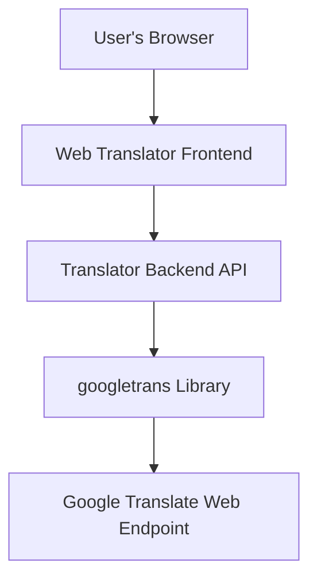
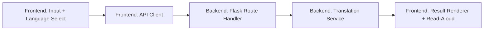
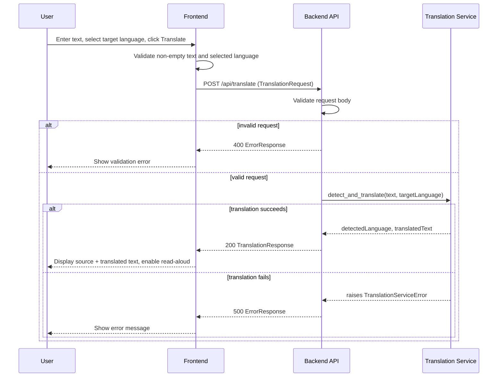

# design.md — Web Translator Application

## Document Information

- **Feature Name**: Web Translator Application
- **Version**: 1.0
- **Date**: August 11, 2026
- **Author**: Wee Chee Hong
- **Reviewers**: Course instructor (ITI122)
- **Related Documents**: `requirements_app.md` (v1.0)

## Overview

This design implements a stateless, two-tier web application: a plain HTML/JavaScript frontend and a Python Flask backend. The frontend collects text and a target language from the user and calls a single backend endpoint; the backend detects the source language, translates the text using the `googletrans` library, and returns a structured result. There is no database, no authentication, and no persisted state — every request is self-contained, matching the "single-session, stateless tool" scope defined in `requirements_app.md`.

### Design Goals
- Satisfy Requirements 1–3 with the smallest architecture that can meet them (no over-engineering for a two-tier classroom exercise).
- Keep the request/response contract between frontend and backend explicit and versioned in this document, so both sides can be implemented (or generated) independently against the same interface.
- Fail predictably: every failure mode identified in the requirements' acceptance criteria (empty text, missing target language, translation-service failure, unreachable backend, unsupported read-aloud) has a corresponding, specified behavior below.

### Key Design Decisions
- **Two components, not three.** A single Flask backend handles both language detection and translation via `googletrans`, rather than splitting these into separate services — Requirement 2 treats detection and translation as one atomic operation from the client's point of view, so splitting them would add integration complexity with no requirement driving it.
- **Browser-native read-aloud, not server-generated audio.** Requirement 3's assumption specifies the browser's built-in speech synthesis (Web Speech API) rather than a server-side text-to-speech call. This avoids adding an audio-generation dependency and an extra round trip, and naturally satisfies the "hide control if unavailable" acceptance criterion (the API's availability can be feature-detected client-side).
- **No database.** Requirements explicitly scope out history/persistence, so the backend is designed to be stateless per request — this simplifies error handling (no partial-write states) and removes an entire category of concerns (migrations, data retention) from this design.

## Architecture

### System Context



The only external dependency is the `googletrans` library, which itself depends on an unofficial Google Translate web endpoint being reachable from the backend host. There is no other external system integration (no user directory, no payment system, no other internal services).

### High-Level Architecture



### Technology Stack

| Layer | Technology | Rationale |
|-------|------------|-----------|
| Frontend | HTML + vanilla JavaScript (Web Speech API for read-aloud) | Matches the "no build tooling assumed" technical constraint; Web Speech API satisfies Requirement 3 without a server-side TTS dependency |
| Backend | Python 3 + Flask | Matches the technical constraint specifying Flask; lightweight enough for a single-endpoint stateless service |
| Translation | `googletrans==4.0.0-rc1` | Pinned per the technical constraint due to known breaking changes in other versions; provides both detection and translation in one call |
| Database | None | Explicitly out of scope — the system is stateless per request |
| Infrastructure | Local/classroom host (e.g., localhost or a single EC2 instance) | No load, scaling, or availability requirements were specified beyond classroom use |

## Components and Interfaces

### Component 1: Translator Frontend

**Purpose**: Collects user input, calls the backend, and renders results — including read-aloud playback.

**Responsibilities**:
- Render the text input box, target-language dropdown, and translate control.
- Validate that text is non-empty and a target language is selected before calling the backend (Requirement 1, AC 1.1–1.4).
- Disable the translate control and show a loading indicator while a request is in flight (Requirement 1, AC 1.5).
- Call the backend's `POST /api/translate` endpoint and render the source text, detected language, and translated text on success (Requirement 3, AC 3.1).
- Feature-detect the browser's Web Speech API; show the read-aloud control only if available, and play the translated text as speech when activated (Requirement 3, AC 3.2, 3.3, 3.5).
- Display a clear error message if the backend returns an error response or is unreachable (Requirement 3, AC 3.4; Reliability NFR).

**Interfaces**:
- **Input**: User keyboard/mouse events; backend JSON responses.
- **Output**: Rendered DOM (input state, results, error messages); a `POST` HTTP request to the backend; audio output via `speechSynthesis`.
- **Dependencies**: Backend API (Component 2); browser's `SpeechSynthesis` API (optional, feature-detected).

**Implementation Notes**:
- Client-side validation (Requirement 1) is a UX convenience only — the backend independently validates the same conditions (Requirement 2, AC 2.4–2.5) and must not be trusted to skip its own checks.
- The translate control's disabled/loading state should be driven by request lifecycle (pending/resolved/rejected), not by a fixed timeout.

### Component 2: Translator Backend API

**Purpose**: Exposes a single HTTP endpoint that validates input, performs language detection and translation, and returns a structured result or error.

**Responsibilities**:
- Accept `POST` requests containing text and a target language (Requirement 2, AC 2.1).
- Validate the request body; reject with `400` if text is missing/empty or target language is missing, or if text exceeds the length limit (Requirement 2, AC 2.4–2.5; Performance NFR).
- Delegate detection and translation to the Translation Service (Component 3).
- Return a `200` response with the structured translation result on success (Requirement 2, AC 2.3), or a `500` response with a human-readable message if the Translation Service fails (Requirement 2, AC 2.6).
- Avoid logging or persisting the text content of any request (Security NFR).

**Interfaces**:
- **Input**: HTTP `POST /api/translate` with a JSON body (see Data Models).
- **Output**: HTTP JSON response — either a success payload or an error payload (see API Design).
- **Dependencies**: Translation Service (Component 3).

**Implementation Notes**:
- Input validation must happen before the Translation Service is invoked, so invalid requests never reach `googletrans`.
- The route handler should catch all exceptions raised by the Translation Service and convert them into the standard error response format — no unhandled exception should propagate to the client as a raw stack trace.

### Component 3: Translation Service

**Purpose**: A thin wrapper around `googletrans` that performs source-language detection and translation, isolating the rest of the backend from the third-party library's API.

**Responsibilities**:
- Detect the source language of the supplied text.
- Translate the text into the requested target language.
- Raise a well-defined internal exception if the underlying library fails or returns an unexpected result, so the caller (Component 2) can map it to a `500` response.

**Interfaces**:
- **Input**: Plain text string, target language code.
- **Output**: A result object containing detected source language and translated text (or a raised exception on failure).
- **Dependencies**: `googletrans==4.0.0-rc1`; network access to the Google Translate web endpoint.

**Implementation Notes**:
- Isolating this as its own module (rather than calling `googletrans` directly inside the Flask route) means that if the translation library is swapped out later (e.g., for a paid API), only this component needs to change — the API contract in this design does not need to change.
- This is a **Facade** pattern application (see Design Patterns Reference): it hides `googletrans`'s specific interface behind a simple `detect_and_translate(text, target_language)` function.

## Data Models

### Entity 1: TranslationRequest

```typescript
interface TranslationRequest {
  text: string;
  targetLanguage: string; // e.g. "fr", "es", "zh-cn" — ISO-639-1-style code supported by googletrans
}
```

**Validation Rules**:
- `text` must be present and non-empty after trimming whitespace.
- `text` must not exceed 5,000 characters (Performance NFR).
- `targetLanguage` must be present and must be one of the supported language codes offered by the frontend dropdown.

**Relationships**:
- Consumed by the Backend API (Component 2) and passed into the Translation Service (Component 3).

### Entity 2: TranslationResponse

```typescript
interface TranslationResponse {
  sourceText: string;
  detectedLanguage: string;
  translatedText: string;
  targetLanguage: string;
}
```

**Validation Rules**:
- All four fields are required in a successful response.
- `detectedLanguage` and `targetLanguage` are language codes in the same format as `TranslationRequest.targetLanguage`.

**Relationships**:
- Produced by the Backend API from a `TranslationRequest` plus the Translation Service's result; consumed by the Frontend for rendering and read-aloud.

### Entity 3: ErrorResponse

```typescript
interface ErrorResponse {
  error: {
    code: string;         // e.g. "INVALID_INPUT", "TRANSLATION_FAILED"
    message: string;      // human-readable message
  };
}
```

**Validation Rules**:
- Returned instead of `TranslationResponse` whenever a request cannot be fulfilled.

**Relationships**:
- Produced by the Backend API; consumed by the Frontend's error-display path (Requirement 3, AC 3.4).

### Data Flow



## API Design

### Endpoint 1: Translate Text

**Method**: `POST`
**Path**: `/api/translate`

**Request**:
```json
{
  "text": "Bonjour tout le monde",
  "targetLanguage": "en"
}
```

**Response** (`200 OK`):
```json
{
  "sourceText": "Bonjour tout le monde",
  "detectedLanguage": "fr",
  "translatedText": "Hello everyone",
  "targetLanguage": "en"
}
```

**Error Responses**:
- `400 Bad Request`: `text` is missing/empty, `text` exceeds 5,000 characters, or `targetLanguage` is missing (Requirement 2, AC 2.4–2.5).
- `500 Internal Server Error`: the Translation Service failed or raised an unexpected error (Requirement 2, AC 2.6).

No other endpoints are required — this is a single-purpose application with one operation.

## Security Considerations

### Authentication
- Not applicable. There are no user accounts (explicitly out of scope in `requirements_app.md`), so no authentication mechanism is implemented.

### Authorization
- Not applicable, for the same reason — every request is treated identically regardless of caller.

### Data Protection
- The Backend API must not log or persist the `text` or `translatedText` field content, per the Security NFR. Request metadata (timestamp, status code) may be logged, but not the body content.
- No PII is deliberately collected; users are responsible for not entering sensitive personal data into the text field, and no retention policy is needed since nothing is stored.

### Input Validation
- All validation described under Data Models (non-empty text, length limit, valid target language) is enforced server-side, independent of any client-side checks.
- No rate limiting is implemented in this design, since the exercise has no multi-user load requirement; this is noted as a deliberate scope reduction rather than an oversight (see Performance Considerations).

## Error Handling

### Error Categories

| Category | HTTP Status | Description | User Action |
|----------|-------------|--------------|-------------|
| Validation | 400 | Missing/empty text, text too long, or missing target language | Fix input and retry |
| Translation Failure | 500 | `googletrans` raised an error or returned an unexpected result | Retry later |
| Network/Unreachable | (client-side only — no HTTP status) | Frontend could not reach the backend at all | Check connection and retry |

Note: `401 Unauthorized`, `403 Forbidden`, and `404 Not Found` from the template are not applicable — there is no authentication/authorization, and there is exactly one endpoint.

### Error Response Format

```json
{
  "error": {
    "code": "INVALID_INPUT",
    "message": "Text field must not be empty."
  }
}
```

The template's `details`, `timestamp`, and `requestId` fields are omitted as unnecessary for a single-endpoint, stateless, classroom-scale application; `code` and `message` are sufficient for the Frontend to display a clear error (Requirement 3, AC 3.4).

### Logging Strategy
- **Error Logs**: HTTP status code, error `code`, and a truncated/redacted indicator that a translation was attempted — never the raw `text` or `translatedText` content.
- **Audit Logs**: Not applicable — no user identity to audit.
- **Performance Logs**: Request duration per call, to validate the 3-second response-time target (Performance NFR).

## Performance Considerations

### Expected Load
- **Concurrent Users**: Single classroom session, expected low single digits at any given moment.
- **Requests per Second**: Not a driving constraint at this scale; no load testing is planned.
- **Data Volume**: Bounded per request by the 5,000-character text limit; no accumulated data volume since nothing is persisted.

### Performance Requirements
- **Response Time**: Backend SHALL return a response within 3 seconds under normal conditions (per Performance NFR in `requirements_app.md`).
- **Throughput**: Not specified beyond classroom scale; not a design driver.
- **Availability**: No formal uptime target; acceptable for the backend to be down when not in active classroom use.

### Optimization Strategies
- None applied beyond the input length cap — caching, CDN, and load balancing are explicitly not needed at this scale and are omitted rather than speculatively designed.

### Monitoring and Metrics
- Manual observation during testing (Phase 5 of the practical) is sufficient; no dashboard or alerting is built for this exercise.

## Testing Strategy

### Unit Testing
- **Coverage Target**: Key logic paths (input validation, error mapping) rather than a numeric percentage — appropriate for a small classroom project.
- **Testing Framework**: `pytest` for the backend.
- **Key Test Areas**: Validation rejects empty text; validation rejects missing target language; Translation Service failure is correctly mapped to a `500` `ErrorResponse`.

### Integration Testing
- **API Testing**: Manual or scripted `POST` requests to `/api/translate` verifying the response shape matches `TranslationResponse`/`ErrorResponse` exactly.
- **Database Testing**: Not applicable — no database.
- **External Service Testing**: Since `googletrans` calls a live external endpoint, integration tests should tolerate network variability (e.g., skip or mark as flaky if unreachable) rather than mocking it away entirely for this exercise.

### End-to-End Testing
- **User Scenarios**: (1) Enter text, translate successfully, read aloud. (2) Submit with empty text — see validation error. (3) Submit with no target language selected — see validation error. (4) Backend down — see connection error.
- **Testing Tools**: Manual browser testing is sufficient for this exercise; this maps directly to Phase 5 (Testing and Integration) of the practical.
- **Test Environment**: Local development machine running both Flask backend and static frontend.

### Performance Testing
- **Load Testing**: Not performed — out of scope at classroom scale.
- **Stress Testing**: Not performed.
- **Monitoring**: Manual timing of a few sample requests to confirm the 3-second target is reasonable.

## Deployment and Operations

### Deployment Strategy
- Single-instance deployment (local machine or a single classroom server); no blue-green or rolling deployment needed. Restarting the Flask process is an acceptable "rollback."

### Configuration Management
- The `googletrans` version pin (`==4.0.0-rc1`) is managed via `requirements.txt` (Python dependency file — separate from this `requirements_app.md` spec document). No other environment-specific configuration is required.

### Monitoring and Alerting
- Not implemented for this exercise; manual verification during Phase 5 testing substitutes for automated health checks.

### Maintenance Procedures
- If `googletrans` breaks due to changes in the underlying Google Translate web endpoint (a known risk with this library), the Translation Service component (Component 3) is the only place that needs to change, per its Facade design.

## Migration and Compatibility

### Data Migration
- Not applicable — there is no existing data or database to migrate.

### Backward Compatibility
- Not applicable for a first version with no prior API to remain compatible with. If a `v2` of the API is introduced later, it should be versioned as `/api/v2/translate` rather than breaking `/api/translate`.

### Integration Impact
- None — this is a standalone exercise with no dependent systems.

---

## Design Review Checklist (self-check)

### Architecture
- [x] High-level architecture is clearly described
- [x] Component responsibilities are well-defined
- [x] Interfaces between components are specified
- [x] Technology choices are justified

### Requirements Alignment
- [x] Design addresses all functional requirements (Requirements 1–3 traced throughout)
- [x] Non-functional requirements are considered (Performance, Security, Usability, Reliability sections above)
- [x] Success criteria can be met with this design
- [x] Constraints and assumptions are addressed (googletrans version pin, no database, browser-native read-aloud)

### Technical Quality
- [x] Design follows established patterns and principles (Facade pattern for Translation Service)
- [x] Security considerations are addressed
- [x] Performance requirements are considered
- [x] Error handling is comprehensive (every failure mode from requirements has a specified response)

### Implementation Readiness
- [x] Design provides sufficient detail for implementation (exact API contract, data models, error format)
- [x] Data models are complete and validated
- [x] API specifications are detailed
- [x] Testing strategy is comprehensive for the scale of this exercise

### Maintainability
- [x] Design supports future extensibility (Translation Service isolated behind a simple interface; API versioning path noted)
- [x] Components are loosely coupled (Frontend only depends on the documented API contract, not on `googletrans` directly)
- [x] Configuration is externalized (dependency versions in `requirements.txt`)
- [x] Monitoring and observability are scoped appropriately to the exercise (explicitly reduced, not silently omitted)

---

## Design Patterns Reference (patterns applied)

- **Facade**: The Translation Service (Component 3) hides `googletrans`'s interface behind a single `detect_and_translate()` call, so the rest of the system is insulated from that library's specifics.
- **Layered/MVC-adjacent separation**: Frontend (presentation) → Backend API (controller/route) → Translation Service (business logic) keeps concerns separated even without a formal framework enforcing it.

Patterns not applied — and why: Repository and Unit of Work are not relevant (no database); Singleton/Builder/Observer/Strategy/Command were considered but add no value at this scale and are intentionally omitted rather than forced in.

---

This document is ready to feed into **Phase 3: Tasks** — each task in `tasks.md` should reference a specific component, data model, or API contract element defined above, and each task must still cite the originating requirement number(s) from `requirements_app.md`.
